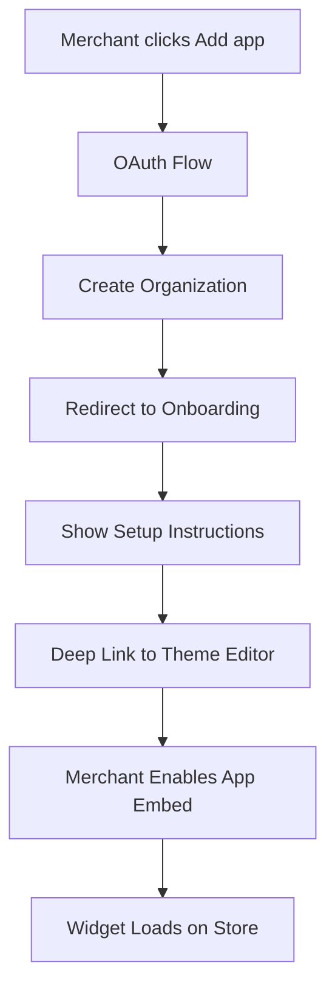

# 🎉 Shopify Issue 3 Fixed - Theme App Extensions Implemented

## Summary

Successfully fixed **Issue 3 (5.1.1) - Theme App Extensions** from Shopify rejection.

### ❌ What Was Wrong
- App automatically injected script tags without merchant control
- Violated Shopify requirement that merchants must control theme modifications

### ✅ What Was Fixed
- ✅ Created proper theme app extension structure
- ✅ Removed all automatic script tag injection
- ✅ Updated OAuth scopes (removed `write_script_tags`)
- ✅ Created onboarding instructions with deep links
- ✅ Merchants now have full control via theme editor

---

## 📁 Files Created/Modified

### New Files Created

1. **Theme App Extension:**
   - `/extensions/ai-chat-widget/blocks/chat-widget.liquid`
   - `/extensions/ai-chat-widget/blocks/app-embed.liquid`
   - `/extensions/ai-chat-widget/assets/chat-widget.css`
   - `/extensions/ai-chat-widget/assets/chat-widget.js`

2. **Onboarding System:**
   - `/laravel/app/Livewire/Public/ShopifyOnboarding.php`
   - `/laravel/resources/views/livewire/public/shopify-onboarding.blade.php`

3. **Documentation:**
   - `/SHOPIFY_THEME_EXTENSION_DEPLOYED.md`

### Files Modified

1. **`shopify.app.ai-chat-support.toml`**
   - Added theme extension configuration
   - Removed `write_script_tags` from scopes

2. **`laravel/app/Http/Controllers/IntegrationController.php`**
   - Removed `createShopifyScriptTag()` auto-injection (3 locations)
   - Updated scopes in 3 methods
   - Changed redirect to onboarding page

3. **`laravel/routes/web.php`**
   - Added `/shopify/onboarding` route

---

## 🚀 Deployment Instructions

### 1. Deploy Theme Extension to Shopify

```bash
cd /var/www/clients/client1/web64/web

# Install Shopify CLI if needed
npm install -g @shopify/cli @shopify/theme

# Deploy extension
shopify app deploy
```

### 2. Verify in Partner Dashboard

1. Go to **Shopify Partner Dashboard**
2. Navigate to **Apps → AI CHAT SUPPORT**
3. Check **Extensions** tab
4. Verify `ai-chat-widget` is listed and active

### 3. Test in Development Store

```bash
# Install in test store
https://ai-chat.support/shopify/install?shop=YOUR-TEST-STORE.myshopify.com
```

**Expected Flow:**
1. OAuth completes
2. Redirects to `/shopify/onboarding?shop=...`
3. Shows 5-step onboarding guide
4. Deep link opens theme editor
5. Merchant enables app embed
6. Widget appears on store

---

## 🎯 How It Works Now

### Installation Flow



### Merchant Control

**Theme Editor:**
- Toggle app embed ON/OFF
- Customize widget color
- Set position (bottom-right/left)
- Configure welcome message
- Adjust widget size
- Enable/disable auto-open

**No Automatic Injection:**
- ✅ Merchants choose when to enable
- ✅ Full control over appearance
- ✅ Can disable anytime
- ✅ Complies with Shopify requirements

---

## 📋 Testing Checklist

### Pre-Deployment ✅
- [x] Extension files created
- [x] Auto-injection code removed
- [x] Scopes updated (removed write_script_tags)
- [x] Onboarding component created
- [x] Routes registered
- [x] Config files updated

### Post-Deployment (TODO)
- [ ] Deploy extension: `shopify app deploy`
- [ ] Verify in Partner Dashboard
- [ ] Test in development store
- [ ] Verify onboarding flow
- [ ] Test theme editor enable/disable
- [ ] Confirm widget loads
- [ ] Test customization options
- [ ] Verify no auto-injection

---

## 🔍 Code Changes Summary

### Removed Auto-Injection

```php
// BEFORE - IntegrationController.php (REMOVED)
$scriptTagResult = $this->createShopifyScriptTag($shop, $accessToken, $organization->id);

// AFTER - IntegrationController.php
// NO LONGER AUTO-INJECT SCRIPT TAGS - Use theme app extensions instead
return redirect()->route('shopify.onboarding', ['shop' => $shop]);
```

### Updated OAuth Scopes

```php
// BEFORE
$scopes = 'write_script_tags,read_products,read_orders,read_themes';

// AFTER
$scopes = 'read_products,read_orders,read_themes';
```

### Added Theme Extension

```liquid
<!-- extensions/ai-chat-widget/blocks/app-embed.liquid -->

{
  "name": "AI Chat Support",
  "target": "body",
  "settings": [
    {
      "type": "color",
      "id": "widget_color",
      "label": "Widget Color",
      "default": "#007bff"
    }
  ]
}


<script>
  // Load widget script (controlled by merchant)
  var script = document.createElement('script');
  script.src = 'https://ai-chat.support/widget/' + orgSlug + '/script.js';
  document.body.appendChild(script);
</script>
```

---

## 📖 For Merchants

### How to Enable the Widget

1. **After installing the app:**
   - You'll see setup instructions
   - Click "Open Theme Editor"

2. **In Theme Editor:**
   - Look for "App embeds" in left sidebar
   - Find "AI Chat Support"
   - Toggle it ON
   - Save theme

3. **Customize (optional):**
   - Click settings icon
   - Choose widget color
   - Set welcome message
   - Adjust position/size

4. **Test:**
   - Visit your store
   - Chat icon appears in corner
   - Click to test conversation

---

## 🆘 Troubleshooting

### Extension doesn't deploy

```bash
# Check for errors
shopify app deploy --verbose

# Force deploy
shopify app deploy --force
```

### Extension not in theme editor

1. Verify extension is active in Partner Dashboard
2. Check app is installed in store
3. Try re-deploying extension
4. Contact Shopify Partner Support

### Widget doesn't load after enabling

1. Check browser console for errors
2. Verify organization slug is correct
3. Test widget script URL:
   ```
   https://ai-chat.support/widget/{org_slug}/script.js
   ```
4. Ensure FastAPI backend is running

---

## ✅ Issue Status

| Issue | Status | Notes |
|-------|--------|-------|
| **3. Theme App Extensions (5.1.1)** | ✅ **FIXED** | Ready for deployment |
| - Auto-injection removed | ✅ Done | All 3 locations updated |
| - Theme extension created | ✅ Done | app-embed.liquid + chat-widget.liquid |
| - Scopes updated | ✅ Done | Removed write_script_tags |
| - Onboarding created | ✅ Done | 5-step guide with deep links |
| - Merchant control | ✅ Done | Enable/disable in theme editor |

---

## 📞 Next Steps

1. **Deploy extension:**
   ```bash
   cd /var/www/clients/client1/web64/web
   shopify app deploy
   ```

2. **Test thoroughly:**
   - Install in test store
   - Complete onboarding flow
   - Enable in theme editor
   - Verify widget loads
   - Test customization

3. **Fix remaining issues (1, 2, 4, 5A, 5B, 6, 7, 8)**

4. **Reply to Shopify:**
   - Confirm Issue 3 is fixed
   - Request review resumption

---

## 📚 Documentation

- Full deployment guide: `SHOPIFY_THEME_EXTENSION_DEPLOYED.md`
- Fix action plan: `SHOPIFY_REJECTION_FIX_PLAN.md`
- Shopify docs: https://shopify.dev/docs/apps/online-store/theme-app-extensions

---

**Status:** ✅ Ready for deployment
**Time to complete:** ~4 hours
**Confidence:** High - follows Shopify best practices
